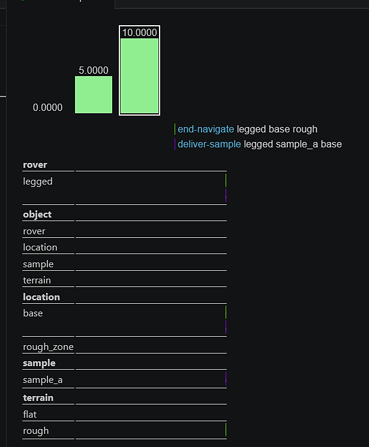
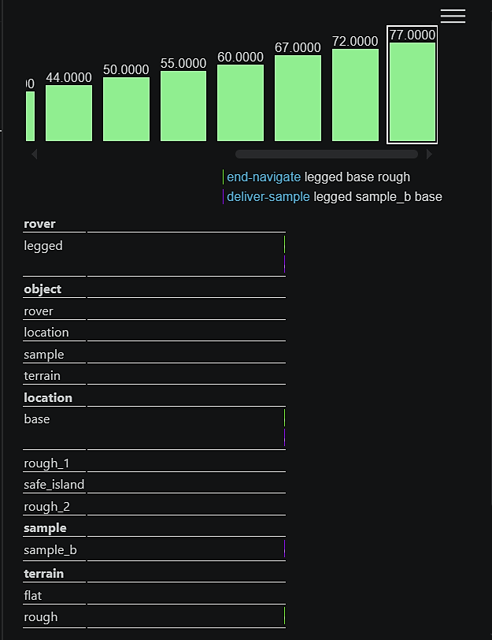
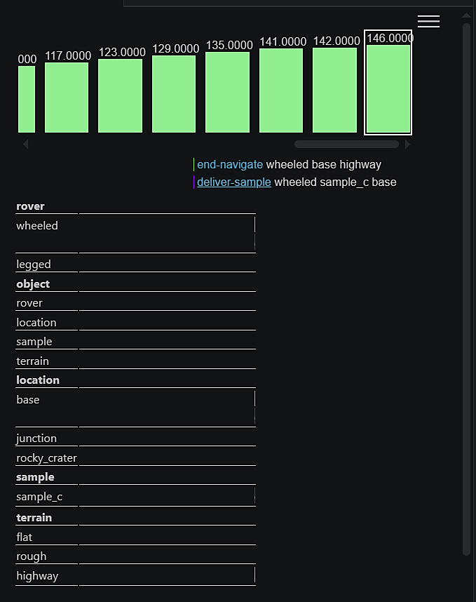
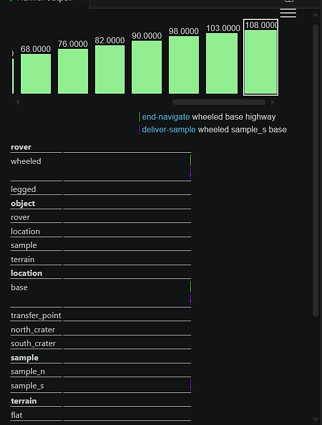

**Final Codes to check: `codes/Question_1/domain.pddl` (Classical PDDL) and `codes/Question_2/domain_pddl_plus.pddl` (PDDL+). All 4 problems in both folders are complete and correct.**

# Planetary Rover - Heterogeneous Multi-Robot Exploration

**Course:** Artificial Intelligence for Robotics II (AI4RO2)  
**Student:** Hussein Mohamad Elnaggar (S8786438)  
**Program:** Master of Science in Robotics Engineering, University of Genoa

---

## 1. Domain and Planning Problem Overview

The project models a multi-agent planetary exploration scenario requiring coordination between heterogeneous rovers (wheeled and legged) to collect and deliver samples to a base station. The environment features distinct terrain topologies (flat, rough, highway) restricting mobility based on hardware capabilities. The project spans two phases:

1. **Phase 1 (Classical STRIPS)**: Utilizes classical planning to validate logical coordination and task allocation.
2. **Phase 2 (PDDL+)**: Elevates the model to a Hybrid Dynamical System, introducing continuous time (`#t`), numeric fluents, and autonomous environmental dynamics.

---

## 2. Modelling Choices

### PDDL (Classical)

To avoid redundant action definitions, robot capabilities are explicitly encoded using the `can-traverse` predicate. The `navigate` action dynamically evaluates whether a specific rover possesses the mechanical capability to traverse the targeted terrain. Consequently, multi-agent cooperation emerges organically from spatial and terrain constraints rather than relying on explicitly forced coordination actions.

### PDDL+ (Hybrid)

In the PDDL+ extension, durative actions were explicitly avoided as they merely schedule discrete jumps without modeling continuous intermediate states. Instead, navigation was decoupled into instantaneous start/end actions modulated by continuous Processes and Events:

- **Processes:**
  - `navigate-process` computes continuous linear distance reduction based on the rover's speed.
  - `accumulate-risk` simulates terrain hazards by increasing the `risk-level` proportionally to the terrain's `risk-rate` over time.
  - `recover-risk` allows active risk depletion when a rover executes a `start-rest` action at a safe (flat) location.
  - Crucially, all processes are conditioned on `(not (is-broken ?r))` to prevent state-space explosion during ENHSP heuristic search — ensuring that upon a failure event, all continuous dynamics halt cleanly.

- **Events:**
  - The `risk-failure` event acts as an autonomous hard environmental constraint. If `risk-level` exceeds `max-risk`, the event automatically triggers, rendering the rover `is-broken` and dropping its speed to zero, effectively pruning invalid trajectories during the heuristic search.

---

## 3. Plan Walkthrough and Output Behavior

- **Forced Cooperation:** By restricting the wheeled rover to flat/highway zones and the legged rover to rough craters, the planner autonomously deduced an asynchronous "relay" workflow. The legged rover mines in hazardous zones, using `drop-sample` at a shared junction. The wheeled rover acts as a courier, utilizing its speed on the highway to finalize delivery.

- **Proactive Risk Mitigation:** In extended rough-terrain missions (Problem 2), the planner mathematically anticipated that a continuous round-trip would breach the `max-risk` threshold, triggering a system failure. The output shows the planner proactively routing to a `safe_island`, executing `start-rest`, and waiting for the `recover-risk` process to safely deplete the accumulated risk before resuming the mission.

---

## 4. Limitations and Known Issues

While PDDL+ excels at high-level reasoning, it abstracts terrain into discrete boolean states (e.g., `(is-rough)`) and uniform numerical risk rates. This creates a fundamental gap in **Task-Motion Planning (TMP)**. It abstracts away vital physical realities such as slope gradients, traction coefficients, and kinodynamic constraints. The task planner assumes unconditional geometric reachability within a node; thus, a symbolically valid plan might fail during low-level control execution if the continuous physical environment presents unmodeled obstacles or varying friction parameters (Belief Space uncertainties).

---

## 5. Planner Outputs

### Phase 1: Classical Planning (STRIPS)

#### Problem 1: Single Robot, Simple Environment

A fundamental sequential planning test where a single wheeled rover must retrieve a sample from a flat terrain location and return it to the base.

```
1. (navigate wheeled_rover base loc_1 flat)
2. (collect-sample wheeled_rover sample_a loc_1)
3. (navigate wheeled_rover loc_1 base flat)
4. (deliver-sample wheeled_rover sample_a base)
```

#### Problem 2: Single Robot, Multiple Samples

An extension of the first problem, requiring the wheeled rover to retrieve two distinct samples scattered across an expanded flat terrain network.

```
1. (navigate wheeled_rover base loc_1 flat)
2. (collect-sample wheeled_rover sample_a loc_1)
3. (navigate wheeled_rover loc_1 base flat)
4. (deliver-sample wheeled_rover sample_a base)
5. (navigate wheeled_rover base loc_1 flat)
6. (navigate wheeled_rover loc_1 loc_2 flat)
7. (collect-sample wheeled_rover sample_b loc_2)
8. (navigate wheeled_rover loc_2 loc_1 flat)
9. (navigate wheeled_rover loc_1 base flat)
10. (deliver-sample wheeled_rover sample_b base)
```

#### Problem 3: Forced Cooperation via Strict Terrain Constraints

This scenario strictly enforces multi-agent coordination. A sample is located in a rough terrain zone inaccessible to the wheeled rover. Conversely, the legged rover cannot traverse the flat terrain leading to the base.

```
1. (navigate legged_rover transfer_zone rocky_crater rough)
2. (collect-sample legged_rover sample_alpha rocky_crater)
3. (navigate legged_rover rocky_crater transfer_zone mixed)
4. (drop-sample legged_rover sample_alpha transfer_zone)
5. (navigate wheeled_rover base transfer_zone mixed)
6. (collect-sample wheeled_rover sample_alpha transfer_zone)
7. (navigate wheeled_rover transfer_zone base flat)
8. (deliver-sample wheeled_rover sample_alpha base)
```

#### Problem 4: Advanced Coordination with Complex Topology

A highly complex scenario involving a branched crater network. Two samples are located in deep, disconnected rough terrain zones.

```
1. (navigate legged_rover hub crater_south rough)
2. (collect-sample legged_rover sample_s crater_south)
3. (navigate legged_rover crater_south hub mixed)
4. (drop-sample legged_rover sample_s hub)
5. (navigate legged_rover hub crater_north rough)
6. (collect-sample legged_rover sample_n crater_north)
7. (navigate legged_rover crater_north hub mixed)
8. (drop-sample legged_rover sample_n hub)
9. (navigate legged_rover hub crater_south rough)
10. (navigate wheeled_rover base hub mixed)
11. (collect-sample wheeled_rover sample_n hub)
12. (navigate wheeled_rover hub base flat)
13. (deliver-sample wheeled_rover sample_n base)
14. (navigate wheeled_rover base hub mixed)
15. (collect-sample wheeled_rover sample_s hub)
16. (navigate wheeled_rover hub base flat)
17. (deliver-sample wheeled_rover sample_s base)
```

---

### Phase 2: PDDL+ Hybrid Dynamical System

#### Problem 1: Baseline Continuous Dynamics

Validates the fundamental continuous processes (distance depletion and risk accumulation) in a simple single-agent scenario. Total elapsed time: **10.0 units**.



#### Problem 2: Proactive Risk Mitigation via Mandatory Resting

Forces the planner to autonomously reason about numeric risk thresholds and utilize the safe_island intermediate node to avoid system failure. Total elapsed time: **77.0 units**.



#### Problem 3: Time-Critical Heterogeneous Cooperation

Demands asynchronous multi-agent cooperation enforced by spatial and terrain constraints, featuring the highway terrain accessible only to the wheeled rover. Total elapsed time: **146.0 units**.



#### Problem 4: Scaled Multi-Agent Optimization

A comprehensive benchmark requiring the concurrent scheduling of two rovers handling multiple targets across complex topology. Total elapsed time: **108.0 units**.


